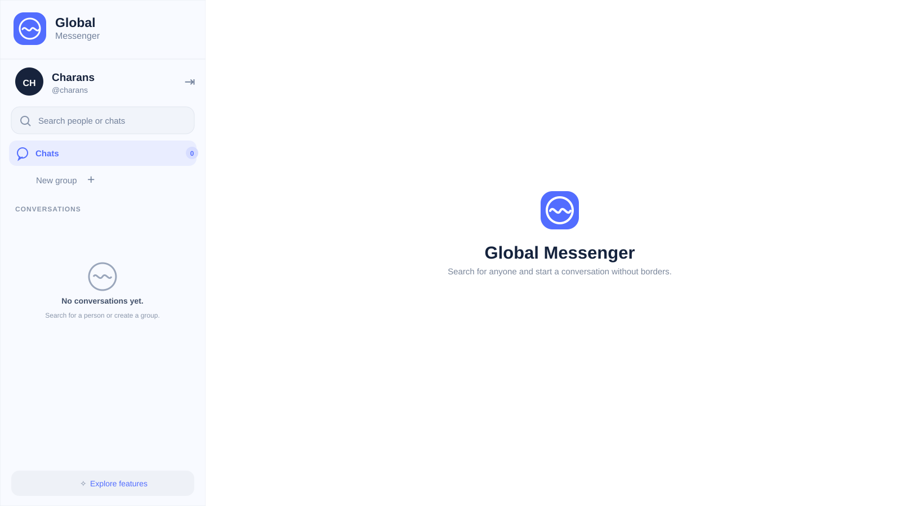

# 🌍 Global Messenger

**Free, realtime messaging built for web, mobile and desktop.**

Global Messenger is an open-source messaging application focused on fast conversations, reliable realtime presence, media sharing, profiles, groups and calling across modern devices.


## ✨ Features

- 💬 Realtime one-to-one messaging
- 👥 Group conversations
- 🟢 Online/offline presence and last seen
- 👤 Profile photos and user profiles
- 😊 Emoji picker and message reactions
- ⌨️ Typing indicators
- 📎 Image and file sharing
- ↩️ Message replies
- ✏️ Message editing
- 🗑️ Delete for me / everyone
- 🧹 Clear chat
- 💾 Conversation export
- 📞 Voice and video calling foundation
- 🎙️ Microphone and camera controls
- 🔔 Notification sounds
- 🔐 JWT authentication with bcrypt passwords
- 📱 Responsive mobile UI
- 🖥️ Desktop-ready experience
- 🤖 Capacitor Android packaging

## 🚀 Product differentiators

Global Messenger is designed to compete on **privacy, ownership and practical AI**, not just another chat clone:

- ✨ **Smart Assist** — optional AI help in the composer to improve a draft without changing its meaning.
- 🔐 **Account ownership controls** — password recovery, account deletion, blocking, bookmarks and pinned messages.
- 🧭 **Local-first engineering** — PostgreSQL + Mailpit can run entirely on a developer machine for predictable testing.
- ⚡ **Realtime-first UX** — Socket.IO presence, typing, delivery, reconnect and offline synchronization.
- 📱 **One product, multiple surfaces** — web today, with Capacitor paths for Android/iOS and desktop-ready UI.
- 🧩 **Provider-independent AI** — the server can use Groq or OpenAI when configured; chat remains usable without AI.

The goal is to make the product feel like a **privacy-first communication workspace with optional AI**, rather than a basic messaging demo.

## 🧭 Local-first development

The repository now uses deterministic local development: `dev` and `build` no longer rewrite application source files through patch scripts. Run the environment check and build before testing the chat UI:

```bash
npm ci
npm run doctor
npm run verify:local
```

Then start the application:

```bash
npm run dev
```

In another terminal:

```bash
npm run smoke
```

See [`docs/LOCAL_TESTING.md`](./docs/LOCAL_TESTING.md) for the complete Windows/macOS/Linux two-account testing checklist.

## 🖼️ Chat screenshot

The screenshot below shows the real Global Messenger chat landing experience and empty-conversation state.



> UI screenshots in this repository should represent the actual application build. Replace `docs/screenshots/chat.svg` with additional real screenshots as the chat, profile, group and mobile flows are captured.

## 🏗️ Architecture

```text
Global Messenger
├── apps/
│   ├── web/          React + TypeScript + Vite + Capacitor
│   └── server/       Fastify API + Socket.IO
├── apps/server/prisma/
│   └── schema.prisma PostgreSQL data model
├── docs/             Development and release documentation
├── .github/
│   └── workflows/   CI workflows
└── package.json
```

## 🧰 Technology stack

| Layer | Technology |
|---|---|
| Frontend | React + TypeScript + Vite |
| UI | Modern responsive CSS + Lucide |
| Backend | Node.js + Fastify |
| Realtime | Socket.IO |
| Database | PostgreSQL + Prisma |
| Authentication | JWT + bcrypt |
| Calls | WebRTC foundation |
| Mobile | Capacitor |
| Containers | Docker Compose |

## 🚀 Run locally

### Requirements

- Node.js 22+
- npm
- Docker Desktop (recommended for PostgreSQL)
- Git

### 1. Clone

```bash
git clone https://github.com/Narsing-s/global-messanger.git
cd global-messanger
```

### 2. Install dependencies

```bash
npm ci
```

### 3. Start PostgreSQL + local email capture

```bash
docker compose up -d postgres mailpit
```

Mailpit captures password-reset emails locally. Open `http://127.0.0.1:8025` to inspect the inbox; SMTP is exposed to the server on port `2525`.

### 4. Configure the server

Copy `apps/server/.env.example` to `apps/server/.env`. The example is configured for local PostgreSQL and includes a placeholder development JWT secret. Never use that placeholder in production.

### 5. Generate Prisma Client and migrate the database

```bash
npm run db:generate
npm run db:migrate
```

### 6. Verify and build

```bash
npm run verify:local
```

### 7. Start the application

```bash
npm run dev
```

The API normally listens on `http://127.0.0.1:4000` and the web application on `http://127.0.0.1:5173`.

### API health check

PowerShell:

```powershell
Invoke-RestMethod http://127.0.0.1:4000/health
```

Command Prompt:

```cmd
curl http://127.0.0.1:4000/health
```

Then run the combined smoke test:

```bash
npm run smoke
```

## 🔐 Authentication

Protected API routes require a valid JWT access token. A `401 No Authorization was found in request.headers` response from a protected endpoint such as `/api/conversations` means the server is running but the request does not contain an access token. This is expected for unauthenticated requests.

The login endpoint should be used first, after which the client must persist and send the returned token using the `Authorization: Bearer <token>` header.

## 🗄️ Database

The application uses PostgreSQL through Prisma. Current core models include:

- User
- Conversation
- ConversationMember
- Message
- MessageReaction
- MessageBookmark
- PinnedMessage
- PushDevice
- UserBlock

Useful commands:

```bash
npx prisma validate --schema ./apps/server/prisma/schema.prisma
npm run db:generate
npm run db:migrate
```

## 🧪 Realtime QA checklist

Use two independent accounts and preferably two browsers/devices:

1. Login Account A and Account B.
2. Confirm both users can see each other online.
3. Send messages in both directions.
4. Switch between several conversations quickly.
5. Verify messages appear without a refresh.
6. Verify typing indicators.
7. Test reactions, replies, editing and deletion.
8. Test image/file sharing.
9. Disconnect and reconnect one client.
10. Verify presence only becomes offline after the user's final active connection disconnects.
11. Verify last-seen information after disconnect.
12. Test profile photo viewing.
13. Test group conversations.
14. Test microphone/camera permissions and calling UI.
15. Confirm there are no blank or white chat screens.

## 🛡️ Production checklist

Before a public launch, configure:

- HTTPS and secure WebSockets
- Strong production JWT secret
- Production PostgreSQL backups and restore testing
- Rate limiting and abuse protection
- Persistent media/object storage
- Restricted production CORS
- Structured logs and error monitoring
- Privacy Policy and Terms of Service
- Account and data deletion workflow
- Camera, microphone and notification permission handling
- Production STUN/TURN infrastructure for reliable WebRTC calls
- Secure environment variables
- Signed Android/desktop packages
- End-to-end encryption and secure device/session management

Never commit `.env` files, passwords, private keys, JWT secrets or database credentials.

## 📱 Platforms

The shared web client is designed to support:

- 🌐 Modern browsers
- 🤖 Android through Capacitor
- 🍎 iPhone/iPad through Capacitor
- 🪟 Windows desktop packaging
- 🍎 macOS desktop packaging

Platform-specific signing, store metadata and release procedures should be documented under `docs/` as the release process matures.

## 💰 Pricing

**Free for end users.**

Operational infrastructure costs are separate from the product's user-facing pricing model.

## 🤝 Contributing

Contributions are welcome — bug fixes, accessibility improvements, UI improvements, documentation, testing and new features.

### Contribution workflow

```bash
git checkout -b feature/my-improvement
npm ci
npm run verify:local
npm run dev
# run smoke + relevant QA
git add .
git commit -m "feat: describe the change"
git push origin feature/my-improvement
```

Then open a pull request with:

- What changed
- Why it changed
- Screenshots for UI changes
- Testing performed
- Any migration or environment-variable requirements

## 🐛 Feedback and issues

Please report reproducible bugs with:

- Browser/device and OS
- Steps to reproduce
- Expected behavior
- Actual behavior
- Relevant console/server logs
- Screenshot or short recording when useful

Do not post passwords, tokens, private keys, personal messages or other sensitive information in an issue.

## 📚 Documentation

- [`docs/LOCAL_TESTING.md`](./docs/LOCAL_TESTING.md)
- [`docs/01-getting-started.md`](./docs/01-getting-started.md)
- [`docs/02-architecture.md`](./docs/02-architecture.md)
- [`docs/03-features.md`](./docs/03-features.md)
- [`docs/04-testing.md`](./docs/04-testing.md)
- [`docs/05-production-deployment.md`](./docs/05-production-deployment.md)
- [`docs/06-android-play-store.md`](./docs/06-android-play-store.md)
- [`docs/07-release-checklist.md`](./docs/07-release-checklist.md)
- [`docs/08-contributing.md`](./docs/08-contributing.md)
- [`docs/STORE_RELEASE.md`](./docs/STORE_RELEASE.md)

## 📄 License

Global Messenger is released under the **MIT License**. See [`LICENSE`](./LICENSE).

## 🌐 Repository

https://github.com/Narsing-s/global-messanger

## 📝 Store copy

### Short description

**Free realtime messaging for everyone — chat, share, react and connect without borders.**

### Long description

**Global Messenger is a free, friendly messaging app built for fast conversations without unnecessary complexity.**

Chat privately or create group conversations, share images and files, see when people are online, and keep conversations moving with realtime delivery. Global Messenger is designed for phones, tablets and desktop users with a responsive experience across platforms.

**Highlights**

- Free messaging
- Private one-to-one conversations
- Group chats
- Realtime online/offline presence
- Profile photos
- Image and file sharing
- Replies and reactions
- Message editing and deletion controls
- Voice and video calling foundation
- Android, iPhone/iPad, Windows and macOS experience

Global Messenger is intended to remain free for end users.
